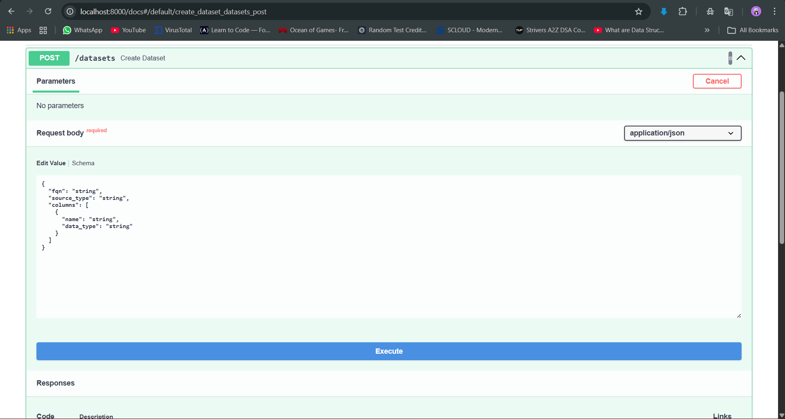
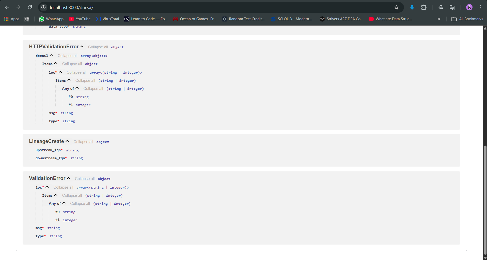

#  Metadata Service


Metadata Service is a lightweight backend system inspired by modern data governance platforms.  
It allows storing dataset metadata, performing priority-based search, and managing lineage relationships while preventing invalid cycles.

* Structured dataset identification using **Fully Qualified Names (FQN)**
* Intelligent **ranked search** across metadata
* **Directed Acyclic Graph (DAG)** lineage tracking
* Cycle detection using graph traversal
* Containerized architecture using Docker

---

## 📌 Dataset Metadata

Each dataset is uniquely identified using:

```
connection.database.schema.table
```

Example:

```
mysql.sales.public.orders
```

Datasets store:

* Source system type
* Column definitions (name + type)
* Lineage relationships

---

## 🔍 Dataset Search

Search results are prioritized by relevance:

| Priority | Match Type |
|----------|------------|
| 1 | Table name |
| 2 | Column name |
| 3 | Schema |
| 4 | Database |

Implemented using SQL scoring logic for result ranking.

---

## 🔗 Dataset Lineage

Datasets can form relationships:

```
bronze.orders_raw
        ↓
silver.orders_clean
        ↓
gold.orders_aggregated
```

✔ Only **valid Directed Acyclic Graphs (DAGs)** allowed  
❌ Cycles are automatically detected and rejected  

Cycle detection uses **Depth-First Search (DFS)** before lineage insertion.

---

## 🏗 Technologies Used


| Layer | Technology |
|------|-----------|
| Framework | FastAPI |
| ORM | SQLAlchemy |
| Database | MySQL |
| Containers | Docker Compose |
| Migrations | Alembic |
| Dependencies | pip |
| Config | .env |

---

## 🚀 Running the Project

Make sure Docker is running.

```bash
docker compose up --build
```

Open API documentation:

```
http://localhost:8000/docs
```

---

## 🧪 API Examples

### Add Dataset

```json
{
  "fqn": "mysql.sales.public.orders",
  "source_type": "MySQL",
  "columns": [
    {"name": "order_id", "data_type": "int"},
    {"name": "amount", "data_type": "float"}
  ]
}
```

---

### Search

```
GET /search?q=orders
```

---

### Add Lineage

```json
{
  "upstream_fqn": "mysql.sales.public.customers",
  "downstream_fqn": "mysql.sales.public.orders"
}
```

---

### Cycle Detection

If system already has:

```
A → B → C
```

Trying to create:

```
C → A
```

Returns:

```
HTTP 400 — Cycle detected in lineage
```

---

## 🧠 Architecture and Design Decisions

Client → FastAPI → SQLAlchemy → MySQL

* FQN parsing enables structured metadata storage
* SQL CASE scoring for search ranking
* DFS algorithm enforces lineage DAG
* Docker ensures environment reproducibility
* MySQL used as lightweight metadata store

---

## ⚠ Limitations

* No Authentication
* No Column-Level Lineage
* Not Designed for Large-Scale Data
* No UI Layer

---

## 📸 Screenshots

Swagger UI:

<p align="center">
  
</p>


Create Dataset:

<p align="center">
  
</p>

Search:

<p align="center">
  
</p>

Add Lineage:

<p align="center">
  
</p>

Schemas:

<p align="center">
  
</p>

<p align="center">
  
</p>
